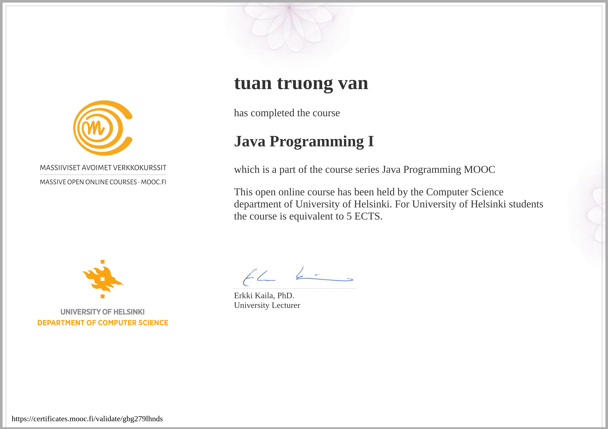

# java-programming-mooc-submit
My submit | Java Programming 1 - from java-programming.mooc.fi

- Java Programming là khóa học online khá nổi tiếng từ trường University of Helsinki (bác Linus Torvalds tốt nghiệp trường này), khóa học được cộng đồng người học Java trên Reddit đánh giá cao.
- Trong khóa học này, bạn sẽ học những kiến ​​thức cơ bản về lập trình máy tính, cùng với các thuật toán và lập trình hướng đối tượng thông qua ngôn ngữ lập trình Java. Khóa học bao gồm các tài liệu toàn diện và nhiều bài tập lập trình - tất cả đều được kiểm tra bằng dịch vụ kiểm tra tự động, viết bằng jUnit rất chi tiết.
- Khóa học được chia thành hai khóa học riêng lẻ: Java Programming I và Java Programming II
# Certificate
